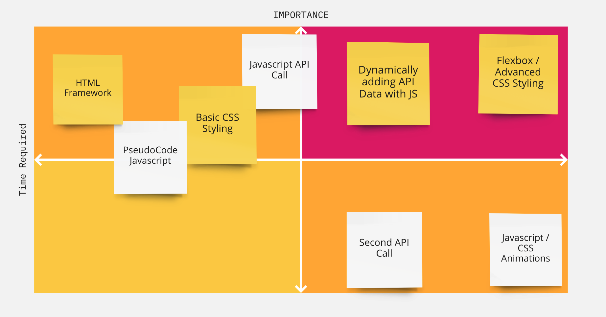

# Project Overview

## The Green Travel Planner


## Project Description
This application will be a flight travel companion for environmentally concious travelers. The user will be 
able to enter their trip details (departure, arrival airports, roundtrip, etc) and the app will display the
carbon footprint implications of this flight and a cost to buy offsets for the pollution - with a link that 
the user can immediately take to buy the carbon offsets.

## API and Data Sample

```json
{
    "footprint": 600,
    "offset_prices": [
        {
            "amount": 2400,
            "currency": "SEK",
            "offset_url": "https://www.goclimate.com/se/flight_offsets/new?offset_params=economy%2CIND%2CSFO",
            "locale": "sv-SE"
        },
        {
            "amount": 290,
            "currency": "USD",
            "offset_url": "https://www.goclimate.com/us/flight_offsets/new?offset_params=economy%2CIND%2CSFO",
            "locale": "en-US"
        }
    ],
    "details_url": "https://www.goclimate.com/se/flight_offsets/new?offset_params=economy%2CIND%2CSFO"
}
```

## Wireframes

View [Wireframe Mock-Up](https://wireframe.cc/IM9yaq).

### MVP/PostMVP

#### MVP 
- Departure and arrival search box for User.
- Checkbox if flight is roundtrip
- Utilize third-party API to pull carbon footprint data from flight.
- Render carbon footprint data to page, including price of the carbon offset, and link to purchase offsets
- Include graphic of air-travel environmental impacts.

#### PostMVP  
- Add second API that could add useful travel information about the destination city. 
- CSS/Javascript Animation-maybe showing airplane taking off and landing when user submits. Another
  animation could be a random number generator for bringing up the price of the offset.

## Project Schedule

|  Day | Deliverable | Status
|---|---| ---|
|Jan 25-26| Prompt / Wireframes / Priority Matrix / Timeframes | Incomplete
|Jan 26| Project Approval | Incomplete
|Jan 27| Core Application Structure (HTML, CSS, etc.) | Incomplete
|Jan 28| Initial Clickable Model  | Incomplete
|Jan 29| MVP | Incomplete
|Feb 1| Presentations/Project Submission | Incomplete

## Priority Matrix



## Timeframes


| Component | Priority | Estimated Time | Time Invested | Actual Time |
| --- | :---: |  :---: | :---: | :---: |
| Basic HTML Setup | H | 2hr|  |  |
| API Endpoint exploration | H |3hrs |  |  |
|PseudoCode Javascript Functions|M|1.5hrs|||
|Initial CSS Styling|H|2hrs|||
|JS Code to Access API and Add Dynamic Results|H|3 Hrs|||
|Flexbox|H|3hrs|||
|CSS Polishing-Fonts, Colors, Etc|M|4hrs|||
|Media Query Dynamic Content|M|3hrs|||
|JS/CSS Animation|L|4hrs|||
|Testing, Bug Fixing Etc|M|2hrs|||
|Second API Call|L|4hrs|||
| Total | H | 31.5hrs| 0hrs | 0hrs |

## Code Snippet


```

```

## Change Log
  
